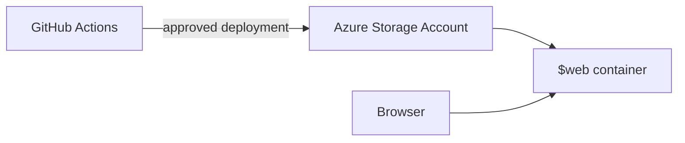
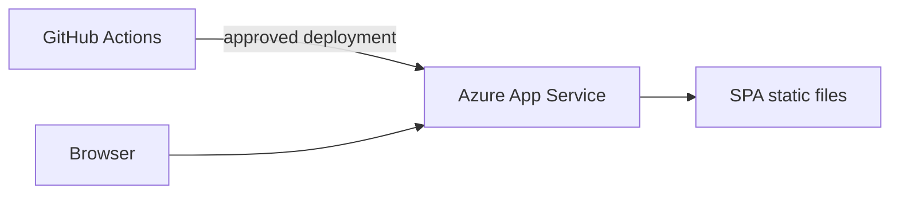
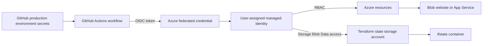

# Architecture summary

The application is a static single-page web app. The CI/CD process is
independent of the hosting choice: build and test the site, publish one
immutable artifact, and deploy it only after the protected production
environment approval.

## Alternative 1: Azure Blob Static Website

Use an Azure Storage Account's static website feature. This is the simplest
and lowest-cost option for static files; add Azure Front Door/CDN and a custom
domain when needed.

## Alternative 2: Azure App Service

Use a Linux App Service to serve the SPA. This costs more but provides a
managed web-app runtime and an easier path to server-side APIs, authentication,
or additional runtime configuration.

## GitHub-to-Azure authentication and Terraform state

Terraform and application deployment use GitHub Actions OIDC rather than
long-lived Azure credentials. The production environment holds the deployment
secrets and required approval. A user-assigned managed identity is trusted by
the repository's federated credential and has only the required Azure roles.

The state storage account and its `tfstate` container are bootstrapped once
with appropriate locking and access controls. State is not committed to Git.
